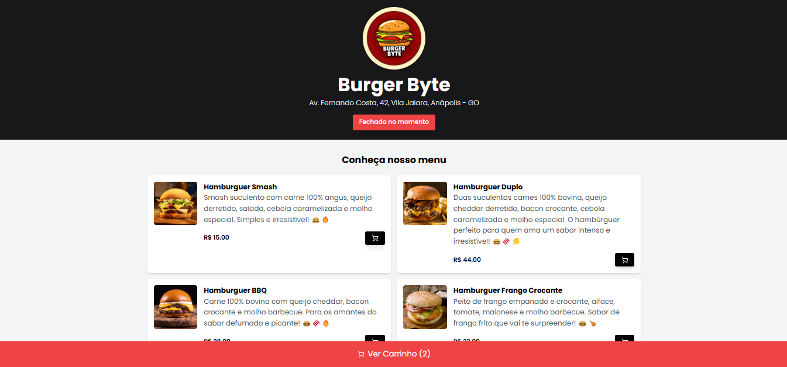
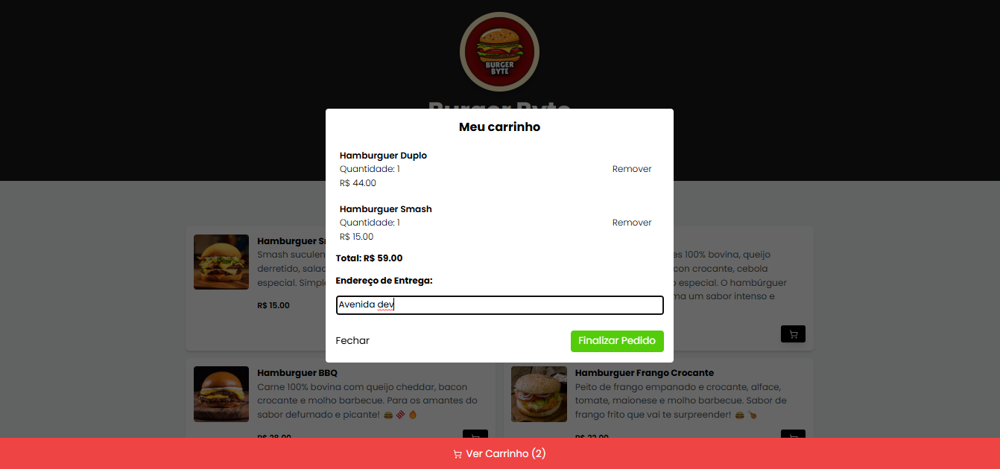

# 🍔 Cardápio Online - Lanchonete Fictícia  

|  |  |  |  |  |
|---|---|---|---|---|

Este projeto é um **cardápio online** para uma lanchonete fictícia, utilizando **React, React Router DOM, TailwindCSS e Json-Server** para simular uma API.  




---  

## 🚀 Deploy no Vercel
O projeto foi deployado no Vercel! Agora, você pode acessar a versão online do cardápio no link abaixo:

🌐 [Acesse o Cardápio Online](https://burgerbyte-56bo.vercel.app/)

Como o vercel não aceita json-server foi desenvolvido uma api apenas para retornar a listagem da mesma maneira que o json-vercel. O link da api está [aqui](https://github.com/Vitorialuz229/burgerbyteApi)

---  

## 💄 Figma 

O layout do projeto foi inspirado e projetado com base no artigo disponível no Figma [aqui](https://www.figma.com/design/tQ95RFOOlni5HiSUVmK2je/Restaurant---Sujeito-Programador-(Community)?node-id=50-23&t=1fDaFcmvoREy2Sou-0), que apresenta o design de um cardápio online para uma lanchonete fictícia.

As imagens estão disponíveis nesse drive [aqui](https://drive.google.com/drive/folders/1XaqCmNgdXjUE7cLzqb53eeOdF7NyaHIi).

---

## 🚀 Tecnologias Utilizadas  

- ⚛️ **React** - Biblioteca para construção de interfaces de usuário.  
- 🚏 **React Router DOM** - Biblioteca para gerenciamento de rotas.  
- 🎨 **TailwindCSS** - Framework CSS utilitário para estilização rápida e responsiva.  
- 📡 **Json-Server** - Simula uma API REST para testes e desenvolvimento.  
- ⚡ **Vite** - Build tool rápida para aplicações modernas.  
- 📝 **TypeScript** - Superset do JavaScript que adiciona tipagem estática.  
- 🎭 **SweetAlert2** - Biblioteca para exibir alertas bonitos e personalizados.

--- 

## 🛠️ Funcionalidades  

- ✅ **Exploração do Cardápio** – Visualize todos os produtos disponíveis no menu.  
- ✅ **Carrinho de Compras Dinâmico** – Adicione produtos ao carrinho com apenas um clique.  
- ✅ **Resumo Rápido do Carrinho** – Consulte os itens adicionados diretamente na página inicial.  
- ✅ **Gerenciamento do Carrinho** – Acesse detalhes do pedido, ajuste quantidades ou remova itens.  
- ✅ **Cadastro de Endereço** – Insira e valide o endereço de entrega antes de finalizar o pedido.  
- ✅ **Horário de Funcionamento** – O sistema verifica se o restaurante está aberto antes de permitir pedidos.  
- ✅ **Checkout Rápido via WhatsApp** – Gere e envie automaticamente o pedido para o WhatsApp do restaurante.  
  
--- 

## ⚡️ Como Executar o Projeto

### Pré-requisitos

- Node.js (versão 16 ou superior)
- npm ou yarn

### Passo a passo

1. Clone este repositório:

   ```bash
   git clone https://github.com/Vitorialuz229/burgerbyte.git
   cd burgerbyte
   ```

2. Instale as dependências:

   ```bash
   npm install
   # ou
   yarn install
   ```

3. Inicie o servidor de desenvolvimento e a API simultaneamente:

   ```bash
   npm run dev
   # ou
   yarn run dev
   ```

   Isso irá rodar os seguintes comandos em paralelo:

   * Vite para iniciar o servidor do frontend
   * Json-Server para simular a API (porta 5000)
  
  Caso queira rodar o Json-Server separadamente, use:

   ```bash
   npm run json-server
   # ou
   yarn json-server
   ```

4. 📜 Scripts Disponíveis
O projeto já vem com os seguintes scripts no package.json:

```json
"scripts": {
  "dev": "concurrently \"vite\" \"npm run json-server\"",
  "build": "tsc -b && vite build",
  "json-server": "json-server --watch db.json --port 5000"
}
```

   * dev: Executa o Vite e o Json-Server simultaneamente.
   * build: Compila o TypeScript e gera o build de produção.
   * json-server: Roda o Json-Server para simular uma API no db.json

5. Abra o navegador e acesse: `http://localhost:5173/`

## 📄 Licença

Este projeto está sob a licença MIT. Consulte o arquivo `LICENSE` para mais detalhes.


👨‍💻 Autor

Desenvolvido por Vitória Luz 🚀